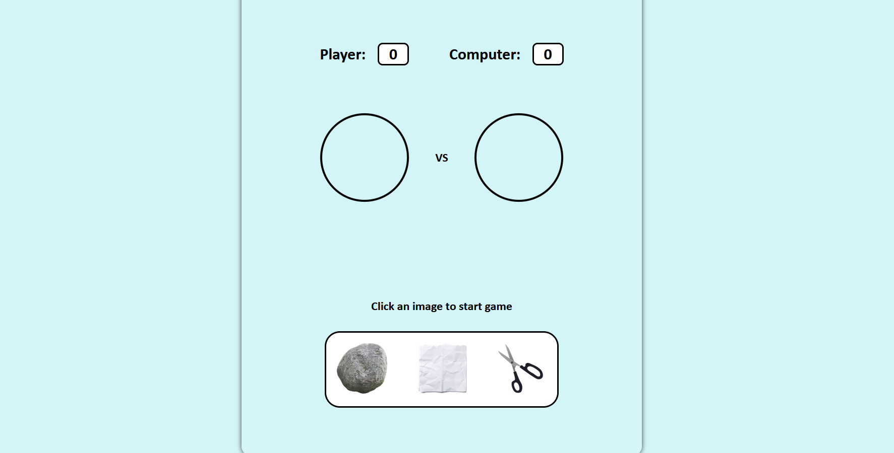
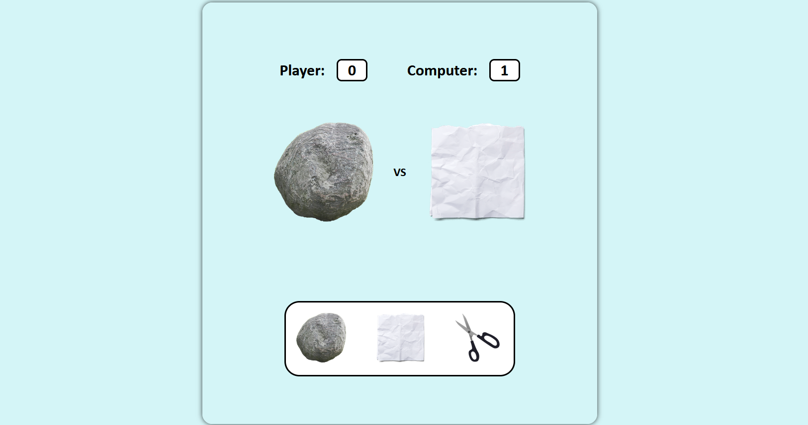

# ODIN_Rock_Paper_Scissors

Welcome to my Rock-Paper-Scissors project! This project is a simple implementation of the classic game Rock-Paper-Scissors, developed as part of The Odin Project's curriculum.

## Description

This implementation includes a basic game where the user can play against the computer. The game can be played in a web browser, and it’s designed to be simple and intuitive.

### Preview:

#### Technologies:

- JavaScript
- HTML
- CSS
